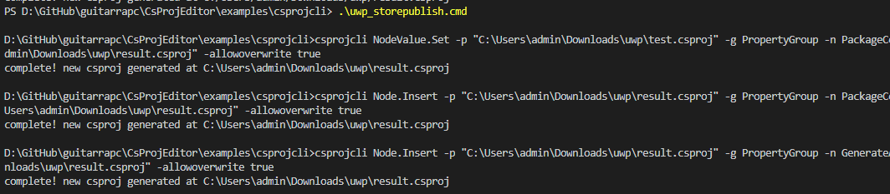
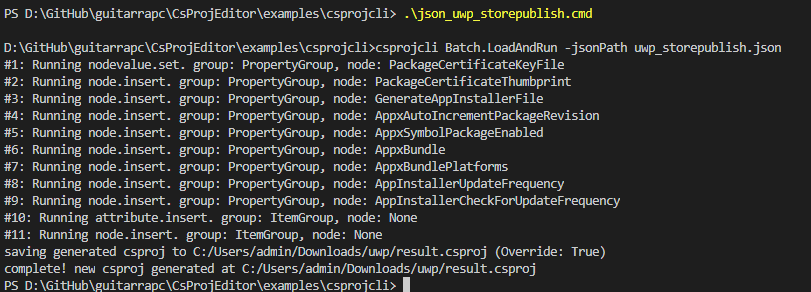

## CsProjEditor

[](https://cloud.drone.io/guitarrapc/CsProjEditor) [](https://codecov.io/gh/guitarrapc/CsProjEditor) [](LICENSE)

[](https://www.nuget.org/packages/CsProjEditor) [](https://www.nuget.org/packages/csprojcli)

This library offers csproj element/attribute operation without EnvDTE.

Load csproj file and create virtual dom, operate and write it out.

## Motivation

When I want to edit csproj for dynamically generated csproj or vscproj, like Unity UWP generates, publish-store required me to operate with Visual Studio.
This tools is for this dynamically operate csproj on CI or automation platform.

## Limitation

* Accept only utf8 and utf8bom encodings.
* Accept only file path or stream. (no parsing string.)

## Install

[NuGet Library](https://www.nuget.org/packages/CsProjEditor/)

```bash
dotnet add package CsProjEditor
```

[CLI (.NET Global Tool)](https://www.nuget.org/packages/csprojcli/)

```bash
dotnet tool install -g csprojcli
```

## NuGet Usage

Load your csproj from path or Stream, then operate node and attribute!

```chsarp
// load csproj
var csproj = CsprojEditor.Load("your.csproj");

// edit
csproj.SetNodeValue("PropertyGroup", "PackageCertificateKeyFile", pfx);
csproj.InsertNode("PropertyGroup", "PackageCertificateThumbprint", thumbprint);
csproj.InsertNode("PropertyGroup", "GenerateAppInstallerFile", "False");
csproj.InsertNode("PropertyGroup", "AppxAutoIncrementPackageRevision", "True");
csproj.InsertNode("PropertyGroup", "AppxSymbolPackageEnabled", "False");
csproj.InsertNode("PropertyGroup", "AppxBundle", "Always");
csproj.InsertNode("PropertyGroup", "AppxBundlePlatforms", "x86");
csproj.InsertNode("PropertyGroup", "AppInstallerUpdateFrequency", "1");
csproj.InsertNode("PropertyGroup", "AppInstallerCheckForUpdateFrequency", "OnApplicationRun");
csproj.InsertAttribute("ItemGroup", "None", "Include", pfx, e => !e.HasAttributes);
csproj.InsertAttribute("ItemGroup", "None", "Include", "Package.StoreAssociation.xml", e => !e.HasAttributes);

// save
csproj.Save(path);
```

more examples? check [examples](https://github.com/guitarrapc/CsProjEditor/tree/master/examples/CsProjEditorSample) and [test](https://github.com/guitarrapc/CsProjEditor/tree/master/tests/CsProjEditor.Tests).

## CLI Usage

You can find help.

```
> csprojcli help
```

You can run for each operation for `group.*`, `node.*`, `nodevalue.*`, `attrribute.*` and `attributevalue.*`.

here's all commands and examples, you can reproduce with commands running at `examples/csprojcli`.

```
Usage: csprojcli [version] [help] [batch.loadandrun|batch.run|groups.get|group.get|group.exists|group.insert|group.replace|group.remove|nodes.get|node.get|node.exists|node.insert|node.replace|node.remove|nodevalue.get|nodevalue.exists|nodevalue.set|nodevalue.append|nodevalue.prepend|nodevalue.replace|nodevalue.remove|attribute.get|attribute.exists|attribute.insert|attribute.replace|attribute.remove|attributevalue.get|attributevalue.exists|attributevalue.set|attributevalue.append|attributevalue.prepend|attributevalue.replace|attributevalue.remove] [parameters]

E.g., run this for Batch execution. see JSON sample at https://raw.githubusercontent.com/guitarrapc/CsProjEditor/master/src/csprojcli/sample.json
--------------------------
$ csprojcli batch.loadandrun -jsonPath examples/csprojcli/uwp_storepublish.json
$ csprojcli batch.run -json JSON

E.g., run this for group execution.:
--------------------------
$ csprojcli groups.get -p SimpleNewCsProjUtf8_CRLF.csproj
$ csprojcli group.get -p SimpleNewCsProjUtf8_CRLF.csproj -g PropertyGroup
$ csprojcli group.exists -p SimpleNewCsProjUtf8_CRLF.csproj -g PropertyGroup
$ csprojcli group.insert -p SimpleNewCsProjUtf8_CRLF.csproj -g PropertyGroup -output result_SimpleNewCsProjUtf8_CRLF.csproj -allowoverwrite true
$ csprojcli group.replace -p SimpleNewCsProjUtf8_CRLF.csproj -g PropertyGroup -pattern Property -replacement Foo -output result_SimpleNewCsProjUtf8_CRLF.csproj -allowoverwrite true
$ csprojcli group.remove -p SimpleNewCsProjUtf8_CRLF.csproj -g PropertyGroup -output result_SimpleNewCsProjUtf8_CRLF.csproj -allowoverwrite true

E.g., run this for node execution.:
--------------------------
$ csprojcli nodes.get -p SimpleNewCsProjUtf8_CRLF.csproj -g PropertyGroup
$ csprojcli node.get -p SimpleNewCsProjUtf8_CRLF.csproj -g PropertyGroup -n TargetFramework
$ csprojcli node.exists -p SimpleNewCsProjUtf8_CRLF.csproj -g PropertyGroup -n TargetFramework
$ csprojcli node.insert -p SimpleNewCsProjUtf8_CRLF.csproj -g PropertyGroup -n PackageCertificateThumbprint -v 1234567890ABCDEF -output result_SimpleNewCsProjUtf8_CRLF.csproj -allowoverwrite true
$ csprojcli node.replace -p SimpleNewCsProjUtf8_CRLF.csproj -g PropertyGroup -n LangVersion -pattern latest -replacement preview -output result_SimpleNewCsProjUtf8_CRLF.csproj -allowoverwrite true
$ csprojcli node.remove -p SimpleNewCsProjUtf8_CRLF.csproj -g PropertyGroup -n LangVersion -output result_SimpleNewCsProjUtf8_CRLF.csproj -allowoverwrite true

E.g., run this for node value execution.:
--------------------------
$ csprojcli nodevalue.get -p SimpleNewCsProjUtf8_CRLF.csproj -g PropertyGroup -n TargetFramework
$ csprojcli nodevalue.exists -p SimpleNewCsProjUtf8_CRLF.csproj -g PropertyGroup -n TargetFramework -v netstandard2.0
$ csprojcli nodevalue.set -p SimpleNewCsProjUtf8_CRLF.csproj -g PropertyGroup -n PackageCertificateKeyFile -v hogehoge.pfx -output result_SimpleNewCsProjUtf8_CRLF.csproj -allowoverwrite true
$ csprojcli nodevalue.append -p SimpleNewCsProjUtf8_CRLF.csproj -g PropertyGroup -n RootNamespace -v SimpleCsProj -append ect -output result_SimpleNewCsProjUtf8_CRLF.csproj -allowoverwrite true
$ csprojcli nodevalue.prepend -p SimpleNewCsProjUtf8_CRLF.csproj -g PropertyGroup -n RootNamespace -v SimpleCsProj -prepend Very -output result_SimpleNewCsProjUtf8_CRLF.csproj -allowoverwrite true
$ csprojcli nodevalue.replace -p SimpleNewCsProjUtf8_CRLF.csproj -g PropertyGroup -n OutputType -v Exe -pattern Exe -replacement AppContainer -output result_SimpleNewCsProjUtf8_CRLF.csproj -allowoverwrite true
$ csprojcli nodevalue.remove -p SimpleNewCsProjUtf8_CRLF.csproj -g PropertyGroup -n AssemblyName -v SimpleCsProj -output result_SimpleNewCsProjUtf8_CRLF.csproj -allowoverwrite true

E.g., run this for group attribute execution.:
--------------------------
$ csprojcli attribute.get -p SimpleNewCsProjUtf8_CRLF.csproj -g Import
$ csprojcli attribute.exists -p SimpleNewCsProjUtf8_CRLF.csproj -g Import -a Include
$ csprojcli attribute.insert -p SimpleNewCsProjUtf8_CRLF.csproj -g Import -a Include -v example.json -output result_SimpleNewCsProjUtf8_CRLF.csproj -allowoverwrite true
$ csprojcli attribute.replace -p SimpleNewCsProjUtf8_CRLF.csproj -g Import -a Include -v project.json -pattern None -replacement Content -output result_SimpleNewCsProjUtf8_CRLF.csproj -allowoverwrite true
$ csprojcli attribute.remove -p SimpleNewCsProjUtf8_CRLF.csproj -g Import -a Exclude -output result_SimpleNewCsProjUtf8_CRLF.csproj -allowoverwrite true

E.g., run this for node attribute execution.:
--------------------------
$ csprojcli attribute.get -p SimpleNewCsProjUtf8_CRLF.csproj -g ItemGroup -n None
$ csprojcli attribute.exists -p SimpleNewCsProjUtf8_CRLF.csproj -g ItemGroup -n None -a Include
$ csprojcli attribute.insert -p SimpleNewCsProjUtf8_CRLF.csproj -g ItemGroup -n None -a Include -v example.json -output result_SimpleNewCsProjUtf8_CRLF.csproj -allowoverwrite true
$ csprojcli attribute.insert -p SimpleNewCsProjUtf8_CRLF.csproj -g Import -a Project,Condition -v ".pack\\package.csproj","Exists('.pack\\package.csproj')" -output result_SimpleNewCsProjUtf8_CRLF.csproj -allowoverwrite true
$ csprojcli attribute.replace -p SimpleNewCsProjUtf8_CRLF.csproj -g ItemGroup -n None -a Include -v project.json -pattern None -replacement Content -output result_SimpleNewCsProjUtf8_CRLF.csproj -allowoverwrite true
$ csprojcli attribute.remove -p SimpleNewCsProjUtf8_CRLF.csproj -g ItemGroup -n None -a Exclude -output result_SimpleNewCsProjUtf8_CRLF.csproj -allowoverwrite true

E.g., run this for attribute value execution.:
--------------------------
$ csprojcli attributevalue.get -p SimpleNewCsProjUtf8_CRLF.csproj -g ItemGroup -n None -a Include
$ csprojcli attributevalue.exists -p SimpleNewCsProjUtf8_CRLF.csproj -g ItemGroup -n Compile -a Include -v App.cs
$ csprojcli attributevalue.set -p SimpleNewCsProjUtf8_CRLF.csproj -g Target -n Message -a Importance -v low - -output result_SimpleNewCsProjUtf8_CRLF.csproj -allowoverwrite true
$ csprojcli attributevalue.append -p SimpleNewCsProjUtf8_CRLF.csproj -g ItemGroup -n None -a Include -v project.json -append ect -output result_SimpleNewCsProjUtf8_CRLF.csproj -allowoverwrite true
$ csprojcli attributevalue.prepend -p SimpleNewCsProjUtf8_CRLF.csproj -g ItemGroup -n None -a Include -v project.json -prepend Very -output result_SimpleNewCsProjUtf8_CRLF.csproj -allowoverwrite true
$ csprojcli attributevalue.replace -p SimpleNewCsProjUtf8_CRLF.csproj -g ItemGroup -n None -a Include -v project.json -pattern project -replacement example -output result_SimpleNewCsProjUtf8_CRLF.csproj -allowoverwrite true
$ csprojcli attributevalue.remove -p SimpleNewCsProjUtf8_CRLF.csproj -g ItemGroup -n None -a Include -v project.json -output result_SimpleNewCsProjUtf8_CRLF.csproj -allowoverwrite true
```

Each command require `save` to overlap previous command execution result, you can do by passing `-dry false` and `-allowoverwrite true`.

```
csprojcli nodevalue.set -p "test.csproj" -g PropertyGroup -n PackageCertificateKeyFile -v hogehoge.pfx -output "result.csproj" -allowoverwrite true
csprojcli node.insert -p "result.csproj" -g PropertyGroup -n PackageCertificateThumbprint -v 1234567890ABCDEF -output "result.csproj" -allowoverwrite true
```




Also, you can define commands in JSON and batch execute it with `batch.loadandrun`.
This will execute defined commands and save, or show dry-run, when everything goes fine.

```
csprojcli batch.loadandrun -jsonPath your_commands.json
```

json should follow to [Scheme](https://github.com/guitarrapc/CsProjEditor/blob/master/src/csprojcli/scheme.json) and here' [all command sample JSON](https://github.com/guitarrapc/CsProjEditor/blob/master/src/csprojcli/sample.json).



more examples? check [examples](https://github.com/guitarrapc/CsProjEditor/tree/master/examples/csprojcli).

## Implementations

* [x] File: Load
* [x] File: ToString override.
* [x] File: Detect UTF8 Bom.
* [x] File: Detect EOL.
* [x] File: Save with original utf8 encoding, keep BOM.
* [x] File: Save will add empty line if last line is value.
* [x] XmlUtils: Get NameSpace (for old csproj, equivalent for new csproj)
* [x] XmlUtils: Get Declaration (for old csproj, equivalent for new csproj)
* [x] XmlUtils: Get space for each node
* [x] Filter: filter node, nodevalue and attribute and pass as XElement
* [x] Group: Get (Groups)
* [x] Group: Exists
* [x] Group: Insert
* [x] Group: Remove
* [x] Group: Replace
* [x] Node: Get (Nodes)
* [x] Node: Exists
* [x] Node: Insert
* [x] Node: Remove
* [x] Node: Replace
* [x] NodeValue: Get
* [x] NodeValue: Exists
* [x] NodeValue: Set
* [x] NodeValue: Append
* [x] NodeValue: Prepend
* [x] NodeValue: Remove
* [x] NodeValue: Replace
* [x] Attribute: Get
* [x] Attribute: Exists
* [x] Attribute: Insert
* [x] Attribute: Set
* [x] Attribute: Remove
* [x] Attribute: Replace
* [x] AttributeValue: Get
* [x] AttributeValue: Exists
* [x] AttributeValue: Set
* [x] AttributeValue: Append
* [x] AttributeValue: Prepend
* [x] AttributeValue: Remove
* [x] AttributeValue: Replace
* [x] Tests: Node
* [x] Tests: NodeValue
* [x] Tests: Attribute
* [x] Tests: AttributeValue
* [x] Tests: Save
